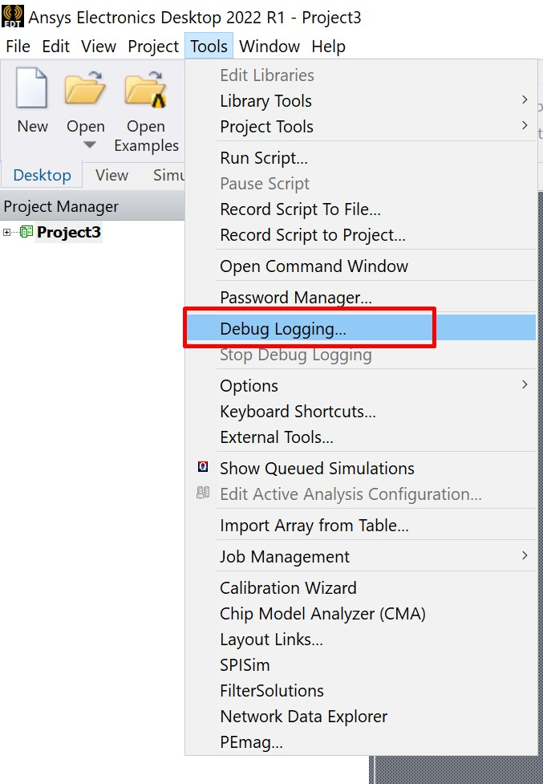

### Interactive debug

1. Open Electronics Desktop
2. Click Tools - Debug Logging
   
3. Set ANSOFT_DEBUG_MODE to the requested level (or leave default 2)
4. Set ANSOFT_DEBUG_LOG to path where log will be stored
5. Reproduce your issue
6. Click Tools - Stop Debug Logging
7. Archive and send folder from step 4

