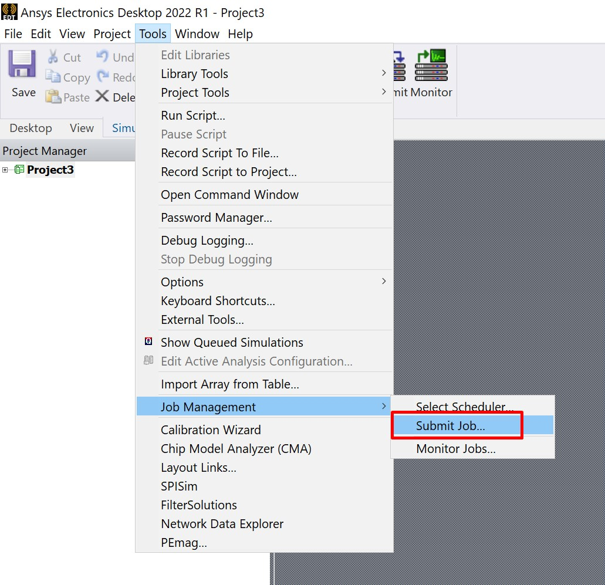
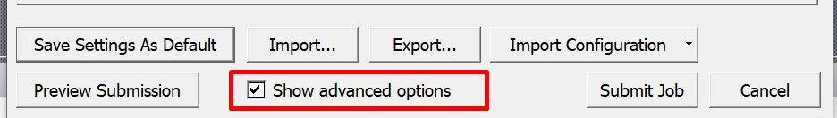
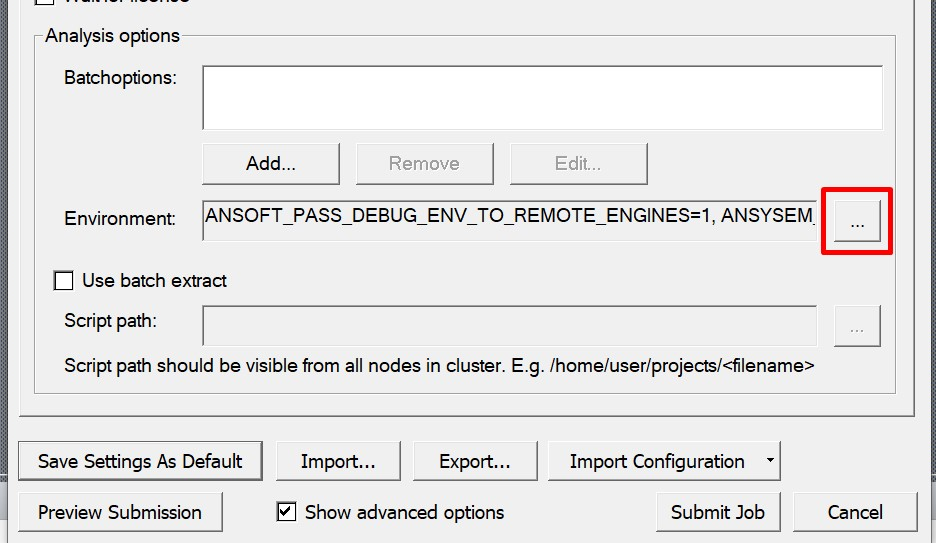
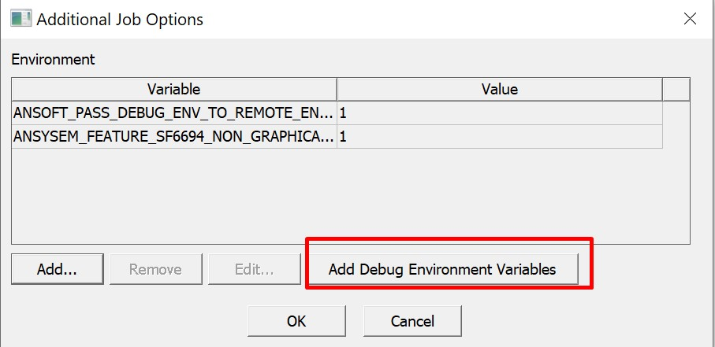

### Debug submitted job

1. Open Electronics Desktop
2. Click Tools - Job Management - Submit job
   
3. Enabled advanced options
   
4. Click on `...` to set environment
   
5. Click Add Debug Variables and press OK
   
6. Set your job as usual and submit
7. Once issue is reproduced you can find `debug_log` folder in your project directory

